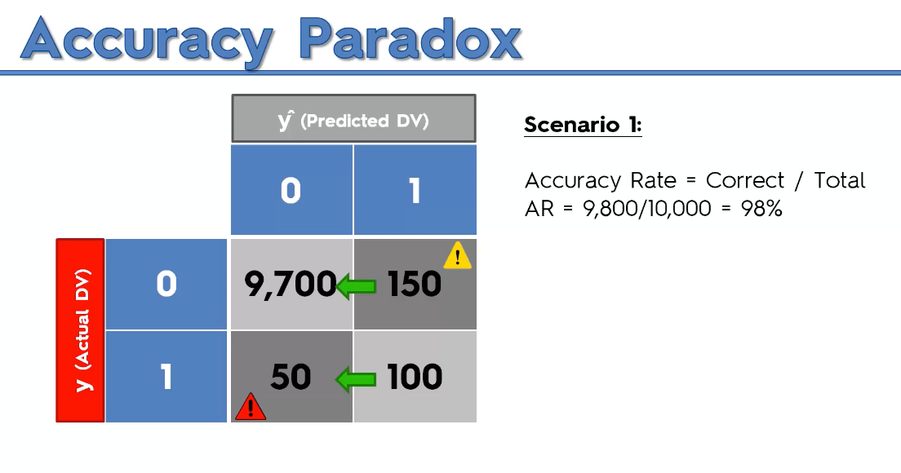
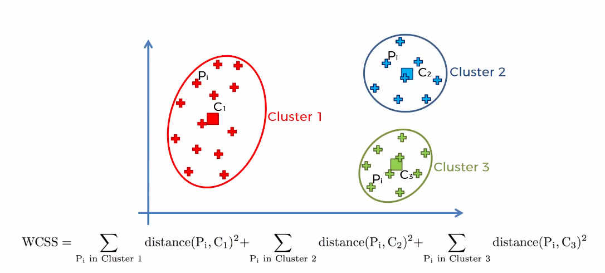
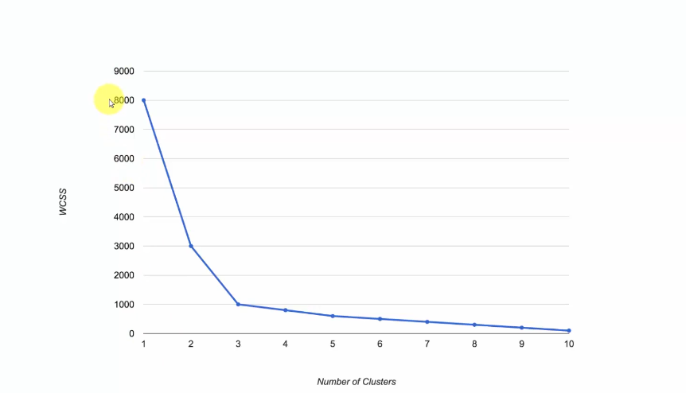

> # Data Preprocessing

## Importing the Libraries
- numpy
: To work with arrays

- matplotlib
: To plot graphs

- pandas
: To work with data matrices and vectors

```python
import numpy as np
import matplotlib.pyplot as plt
import pandas as pd
```

## Importing the Dataset
| Country | Age  | Salary  | Purchased |
|---------|------|---------|-----------|
| France  | 44.0 | 72000.0 | No        |
| Spain   | 27.0 | 48000.0 | Yes       |
| Germany | 30.0 | 54000.0 | No        |
| Spain   | 38.0 | 61000.0 | No        |
| Germany | 40.0 | NaN     | Yes       |
| France  | 35.0 | 58000.0 | Yes       |
| Spain   | NaN  | 52000.0 | No        |
| France  | 48.0 | 79000.0 | Yes       |
| Germany | 50.0 | 83000.0 | No        |
| France  | 37.0 | 67000.0 | Yes       |
```python
dataset = pd.read_csv('../Path/Data.csv')
X = dataset.iloc[:,:-1].values
y = dataset.iloc[:,-1].values
print(X)
print(y)
```

## Taking care of missing data
1. Exclude rows of missing Data
2. Replacing missing values to
    - Mean value
    - Median value
    - Mode value


## Importing other modules

- scikit-learn
: module for machine learning and data mining


```python
from sklearn.impute import SimpleImputer
imputer = SimpleImputer(missing_values=np.nan, strategy='mean')
imputer.fit(X[:,1:3])
X[:,1:3] = imputer.transform(X[:,1:3])
print(X)
```

| Country | Age  | Salary  | Purchased |
|---------|------|---------|-----------|
| France  | 44.0 | 72000.0 | No        |
| Spain   | 27.0 | 48000.0 | Yes       |
| Germany | 30.0 | 54000.0 | No        |
| Spain   | 38.0 | 61000.0 | No        |
| Germany | 40.0 | 63777.7 | Yes       |
| France  | 35.0 | 58000.0 | Yes       |
| Spain   | 38.8 | 52000.0 | No        |
| France  | 48.0 | 79000.0 | Yes       |
| Germany | 50.0 | 83000.0 | No        |
| France  | 37.0 | 67000.0 | Yes       |

## Encoding categorial data [Independent Variable]
Categorial data, needs to be encoded to numerical data type
- OneHotEncoder
: converts a categorial data column into sevral columns of 0 and 1


```python
from sklearn.compose import ColumnTransformer
from sklearn.preprocessing import OneHotEncoder
ct = ColumnTransformer(transformers=[('encode',OneHotEncoder(),[0])], remainder='passthrough')
X = np.array(ct.fit_transform(X))
print(X)
```


| Country0 | Country1 | Country1 | Age  | Salary   | Purchased |
|----------|----------|----------|------|----------|-----------|
| 1.0      | 0.0      | 0.0      | 44.0 | 72000.0  | No        |
| 0.0      | 0.0      | 1.0      | 27.0 | 48000.0  | Yes       |
| 0.0      | 1.0      | 0.0      | 30.0 | 54000.0  | No        |
| 0.0      | 0.0      | 1.0      | 38.0 | 61000.0  | No        |
| 0.0      | 1.0      | 0.0      | 40.0 | 63777.8  | Yes       |
| 1.0      | 0.0      | 0.0      | 35.0 | 58000.0  | Yes       |
| 0.0      | 0.0      | 1.0      | 38.8 | 52000.0  | No        |
| 1.0      | 0.0      | 0.0      | 48.0 | 79000.0  | Yes       |
| 0.0      | 1.0      | 0.0      | 50.0 | 83000.0  | No        |
| 1.0      | 0.0      | 0.0      | 37.0 | 67000.0  | Yes       |

## Encoding categorial data [Dependent Variable]
- Label Encoder
: Convert categorial data into binary

```python
from sklearn.preprocessing import LabelEncoder
le = LabelEncoder()
y = le.fit_transform(y)
print(y)
```

| Country0 | Country1 | Country2 | Age  | Salary   | Purchased |
|----------|----------|----------|------|----------|-----------|
| 1.0      | 0.0      | 0.0      | 44.0 | 72000.0  | 0         |
| 0.0      | 0.0      | 1.0      | 27.0 | 48000.0  | 1         |
| 0.0      | 1.0      | 0.0      | 30.0 | 54000.0  | 0         |
| 0.0      | 0.0      | 1.0      | 38.0 | 61000.0  | 0         |
| 0.0      | 1.0      | 0.0      | 40.0 | 63777.8  | 1         |
| 1.0      | 0.0      | 0.0      | 35.0 | 58000.0] | 1         |
| 0.0      | 0.0      | 1.0      | 38.8 | 52000.0  | 0         |
| 1.0      | 0.0      | 0.0      | 48.0 | 79000.0  | 1         |
| 0.0      | 1.0      | 0.0      | 50.0 | 83000.0  | 0         |
| 1.0      | 0.0      | 0.0      | 37.0 | 67000.0  | 1         |

## Spliting the dataset into Training and Test data
Split dataset into train and test data, to test the model

```python
from sklearn.model_selection import train_test_split
X_train, X_test, y_train, y_test = train_test_split(X, y, test_size=0.2, random_state=1)
```

## Feature Scaling
Scaling Dataset, such that all the values lie inside a small range
- Standardisation
: This will scale values to [-3,+3]

$$ X_{stand} = \frac{x- X_{mean}}{standard \ \ deviation(X)} $$

- Normalisation
: This will scale values to [0,1]

$$ X_{norm} = \frac{x- X_{mean}}{max(X)-min(X)} $$

```python
from sklearn.preprocessing import StandardScaler
sc = StandardScaler()
# fit using training data
sc.fit(X_train[:,3:])
# transform training data using the scaler
X_train[:,3:] = sc.transform(X_train[:,3:])
# transform test data using the same scaler
X_test[:,3:] = sc.transform(X_test[:,3:])
```

<br/>
<hr/>
<br/>

> # Regression

## Simple Linear Regression

### Predicts continious numerical values
In simple linear regression, we simply predict value based on an equation

$$ y = b_{0} \ \ + \ \ b_{1}x $$

In above equation, y will depend on the values of x, so we can predict/calculate value of y, if value of x is already known.


### Loading the Dataset

```python
import numpy as np
import matplotlib.pyplot as plt
import pandas as pd 

dataset = pd.read_csv("./Regression/Simple_Linear_Regression/Datasets/Salary_Data.csv")

X=dataset.iloc[:,:-1].values
y=dataset.iloc[:,-1].values


from sklearn.model_selection import train_test_split
X_train, X_test, y_train, y_test = train_test_split(X, y, test_size=0.2, random_state=1)
```

### Training the Simple Regression Model on the Training dataset

In this step, Simple Linear Regression model is trained using the training dataset.   
Simply equation for the Linear Regression is computed, using training dataset.

```python
from sklearn.linear_model import LinearRegression
regressor = LinearRegression()
regressor.fit(X_train, y_train)
```

### Predicting the result for Test Dataset
In this step, result for test data is predicted using above trained model.

```python
y_pred = regressor.predict(X_test)
print(y_pred)
print(y_test)
```

### Visualising the Training set result

```python
plt.scatter(X_train, y_train, color='red')
plt.plot(X_train, regressor.predict(X_train), color='blue')
plt.title('Experience vs Salary')
plt.xlabel('Years of Experience')
plt.ylable('Salary')
plt.show()
```

### Visualising the Test set result

```python
plt.scatter(X_test, y_test, color='red')
plt.plot(X_test, y_pred, color='blue')
plt.title('Experience vs Salary')
plt.xlabel('Years of Experience')
plt.ylable('Salary')
plt.show()
```

### Predict salary for a single Experience

```python
print(regressor.predict([[0]]))
```

### Computing the Linear Regression Equation

```python
n=len(X_train[0])
ans=[]
b0=regressor.predict([[0  for _ in range(n)]])
eq="y = "+str(b0[0])
for i in range(n):
    ar=[[0 for _ in range(i)]+[1]+[0 for _ in range(i+1,n)]]
    b=regressor.predict(ar)
    eq+=" + {}*x{}".format(b[0],i+1)
print(eq)
```

## Multiple Linear Regression

If there are multiple variables inside Linear Regression Equation, it is known as Multiple Linear Regression

Let's see equation

$$y = b_{0} \ \ + \ \ b_{1}x_{1}  \ \ + \ \ b_{2}x_{2}  \ \ + \ \ b_{3}x_{3} \ \ + \ \ ... \ \ + \ \ b_{n}x_{n}$$

Now y will depend on multiple values, we can still predict/calculate value of y, if we have the equation and the values of the X.

### Assumptions of Linear Regression
There are 5 assumptions
1. Linearity
2. Homoscedasticity
3. Multivariate Normality
4. Independence of Errors
5. Lack of Multicollinearity

### Hypothesis Testing (P-Value)
Supose you have a coin, and you are tossing it continiously
1. got HEAD, its probability is 0.5
2. got again HEAD, its probability is 0.25
3. got again HEAD, its probability is 0.12
4. got again HEAD, its probability is 0.06

If you get get HEAD again (probability 0.03), coin is suspicous. you may think coin is not a fair coin.
The point/percent at which you become suspicious is known as **Significance Value**.

Initially we assume coin is fair, but when the significance value is reached, we correct our assumption (Hypothesis) and confirm that it is not a fair coin, this is known as **Null Hypothesis Testing**.

### Building a Multiple Linear Regression Model
There are 5 ways to build Multiple Linear Regression Model
1. All In
:  Select all the columns
    - You have prior knowledge
    - You have to select all columns
    - You are preparing for backward elimination
2. Backward Elimination (Fastest)
    1. Select a Significance Level to stay in the model (SL=0.05)
    2. Fit the model with all columns/predictor
    3. Select the column/predictor with highest P-Value, if P-Value > SL goto step 4, else go to FINISH
    4. Remove the predictor
    5. Fit the model again, and go to step 3
3. Forward Selection
    1. Select a Significance Level to Enter in the model (SL=0.05)
    2. Fit the model with all predictors seperately
    3. Select the predictor with lowest P-value, if P-value < SL goto step 4, else FINISH and keep the last model
    4. Fit the model, using all the remaining predictors separately and with this one extra combination
4. Bidirection Elemination
    1. Select a Significance Level to stay in the model (STAY_SL=0.05) and a Significance Level to Enter in the model (ENTER_SL=0.05)
    2. Perform next step of Forward Selection
    3. Perform all step of Backward Elimination
    4. When no new predictors enter and no old predictors can exit, FINISH
5. Score Comparision
    1. Select a criterion of goodness (Score)
    2. Construct all possible regression model (2<sup>N</sup>-1)
    3. Select the best model using goodness criterion
    4. FINISH

Step-wise Regression
- Backward Elimination
- Forward Selection
- Bidirection Elemination

### Loading Data and preprocessing it

```python
import numpy as np
import matplotlib.pyplot as plt
import pandas as pd

dataset = pd.read_csv('./Datasets/Regression/Multiple_Linear_Regression/50_Startups.csv')
# print(dataset)

X = dataset.iloc[:,:-1].values
y = dataset.iloc[:,-1].values

# Taking care of Missing values
from sklearn.impute import SimpleImputer 
imputer = SimpleImputer(missing_values=np.nan, strategy='mean')
imputer.fit(X[:,:-1])
X[:,:-1] =  imputer.transform(X[:,:-1])
imputer = SimpleImputer(missing_values=np.nan, strategy='most_frequent')
imputer.fit(X[:,-2:-1])
X[:,-2:-1] =  imputer.transform(X[:,-2:-1])
# print(X)

# Encoding categorial Data [One Hot Encoding]
from sklearn.compose import ColumnTransformer
from sklearn.preprocessing import OneHotEncoder
ct = ColumnTransformer(transformers=[('encode',OneHotEncoder(),[-1])], remainder='passthrough')
X = np.array(ct.fit_transform(X))
# print(X)

# Splitting dataset into train and test set
from sklearn.model_selection import train_test_split
X_train, X_test, y_train, y_test = train_test_split(X, y, test_size=0.2, random_state=1)
```

### Training the Linear Regression Model on the training set

```python
from sklearn.linear_model import LinearRegression
regressor = LinearRegression()
regressor.fit(X_train, y_train)
```

### Predicting the result for test set result

```python
y_pred = regressor.predict(X_test)
```

### Visualising the predicted and actual results

```python
np.set_printoptions(precision=2)
print(np.concatenate((y_pred.reshape(len(y_pred),1), y_test.reshape(len(y_test),1)),axis=1))
```

### Computing the equation of model
```python
n = len(X_train[0])
b0=regressor.predict([[0 for _ in range(n)]])
eq="y = {}".format(b0[0])
for i in range(n):
    eq+=" + {}*x{}".format(regressor.predict([[0 for _ in range(i)]+[1]+[0 for _ in range(i+1,n)]])[0],i+1)
print(eq)
```

## Polynomial Regression

If the power raise to variable is not only 1, but may have different powers of the variable x, it is known as Polynomial Regression.
Let's see the equation

$$y = b_{0} \ \ + \ \ b_{1}x^{1}  \ \ + \ \ b_{2}x^{2}  \ \ + \ \ b_{3}x^{3} \ \ + \ \ ... \ \ + \ \ b_{n}x^{n}$$

Now y will depend on multiple powers of the x, we can still predict/calculate value of y, if we have the equation and the value of the x.

```python
import numpy as np
import matplotlib.pyplot as plt
import pandas as pd

dataset = pd.read_csv('../Datasets/Regression/Polynomial_Regression/Position_Salaries.csv')
# print(dataset)

X = dataset.iloc[:,1:-1].values
y = dataset.iloc[:,-1].values

print(X)
print(y)

# Taking care of Missing values
# from sklearn.impute import SimpleImputer 
# imputer = SimpleImputer(missing_values=np.nan, strategy='mean')
# imputer.fit(X[:,:-1])
# X[:,:-1] =  imputer.transform(X[:,:-1])
# imputer = SimpleImputer(missing_values=np.nan, strategy='most_frequent')
# imputer.fit(X[:,-2:-1])
# X[:,-2:-1] =  imputer.transform(X[:,-2:-1])
# print(X)

# Encoding categorial Data [One Hot Encoding]
# from sklearn.compose import ColumnTransformer
# from sklearn.preprocessing import OneHotEncoder
# ct = ColumnTransformer(transformers=[('encode',OneHotEncoder(),[-1])], remainder='passthrough')
# X = np.array(ct.fit_transform(X))
# # print(X)

# # Splitting dataset into train and test set
# from sklearn.model_selection import train_test_split
# X_train, X_test, y_train, y_test = train_test_split(X, y, test_size=0.2, random_state=1)
```

### Training the linear regression model on whole dataset

```python
from sklearn.linear_model import LinearRegression
lin_reg_1 =  LinearRegression()
lin_reg_1.fit(X,y)
```

### Training the polynomial regression model on whole dataset [ n=2 ]

```python
from sklearn.preprocessing  import PolynomialFeatures
poly_fet = PolynomialFeatures(degree=2)
poly_X = poly_fet.fit_transform(X)
lin_reg_2 = LinearRegression()
lin_reg_2.fit(poly_X,y)
```

### Visualising the Linear Regression result

```python
plt.scatter(X,y,color='red')
plt.plot(X,lin_reg_1.predict(X),color='blue')
plt.title('Truth or Bluff (Linear Regression Model)')
plt.show()
```

### Visualising the Polynomial Regression result

```python
plt.scatter(X,y,color='red')
plt.plot(X,lin_reg_2.predict(poly_X),color='blue')
plt.title('Truth or Bluff (Polynomial Regression Model) n=2')
plt.show()
```

### Training the polynomial regression model on whole dataset [ n=4 ]

```python
from sklearn.preprocessing  import PolynomialFeatures
poly_fet = PolynomialFeatures(degree=4)
poly_X = poly_fet.fit_transform(X)
lin_reg_2 = LinearRegression()
lin_reg_2.fit(poly_X,y)
```

### Visualising the Polynomial Regression result

```python
plt.scatter(X,y,color='red')
plt.plot(X,lin_reg_2.predict(poly_X),color='blue')
plt.title('Truth or Bluff (Polynomial Regression Model) n=4')
plt.show()
```

### Visualising the Polynomial Regression result with higher resolution and smoother curve

```python
from sklearn.preprocessing  import PolynomialFeatures

poly_fet = PolynomialFeatures(degree=4)
poly_X = poly_fet.fit_transform(X)
lin_reg_2 = LinearRegression()
lin_reg_2.fit(poly_X,y)
X_grid = np.arange(min(X),max(X),0.1)
X_grid = X_grid.reshape((len(X_grid),1))
plt.scatter(X,y,color='red')
plt.plot(X_grid,lin_reg_2.predict(poly_fet.fit_transform(X_grid)),color='blue')
plt.title('Truth or Bluff (Polynomial Regression Model) n=4, smooth curve')
plt.show()
```

### Predicting a new result using Linear Model

```python
lin_reg_1.predict([[6.5]])
```

### Predicting a new result using Polynomial Model

```python
lin_reg_2.predict(poly_fet.fit_transform([[6.5]]))
```

## Support Vector Regression [ SVR ]

In this regression, instead of a regression line, a hyperplane is used.\
Points lying insdie/on the hyperplane are allowed errors, Points lying outside the hyperplane are known as support vector,\
Hence this is known as **Support Vector Regression [SVR]**

### Loading Data and preprocessing it

```python
import numpy as np
import matplotlib.pyplot as plt
import pandas as pd

dataset = pd.read_csv('../Datasets/Regression/Support_Vector_Regression/Position_Salaries.csv')
# print(dataset)

X = dataset.iloc[:,1:-1].values
y = dataset.iloc[:,-1].values

print(X)
print(y)

# Taking care of Missing values
# from sklearn.impute import SimpleImputer 
# imputer = SimpleImputer(missing_values=np.nan, strategy='mean')
# imputer.fit(X[:,:-1])
# X[:,:-1] =  imputer.transform(X[:,:-1])
# imputer = SimpleImputer(missing_values=np.nan, strategy='most_frequent')
# imputer.fit(X[:,-2:-1])
# X[:,-2:-1] =  imputer.transform(X[:,-2:-1])
# print(X)

# Encoding categorial Data [One Hot Encoding]
# from sklearn.compose import ColumnTransformer
# from sklearn.preprocessing import OneHotEncoder
# ct = ColumnTransformer(transformers=[('encode',OneHotEncoder(),[-1])], remainder='passthrough')
# X = np.array(ct.fit_transform(X))
# # print(X)

# # Splitting dataset into train and test set
# from sklearn.model_selection import train_test_split
# X_train, X_test, y_train, y_test = train_test_split(X, y, test_size=0.2, random_state=1)
```

### Feature Scaling

```python
from sklearn.preprocessing import StandardScaler

sc_X = StandardScaler()
sc_X.fit(X)
X = sc_X.transform(X)

# reshape y
y = y.reshape((len(y),1))

sc_y = StandardScaler()
sc_y.fit(y)
y = sc_y.transform(y)

print(X)
print(y)
```

### Training the SVR model on the whole dataset

```python
from sklearn.svm import SVR
regressor =  SVR(kernel='rbf')
regressor.fit(X,y.ravel())
```

### Predict the salary for new test case

```python
y_pred = regressor.predict(sc_X.transform([[6.5]]))
print(y_pred)
y_pred = sc_y.inverse_transform(y_pred.reshape(1,1))
print(y_pred)
```

### Visualising the SVR model

```python
plt.scatter(sc_X.inverse_transform(X),sc_y.inverse_transform(y),color='red')
plt.plot(sc_X.inverse_transform(X),sc_y.inverse_transform(regressor.predict(X).reshape(len(y),1)),color='blue')
plt.title('Truth or Bluff (Support Vector Regression Model)')
plt.show()
```

### Visualising the SVR model in High Resolution

```python
X_grid = np.arange(min(sc_X.inverse_transform(X)),max(sc_X.inverse_transform(X)),0.1)
X_grid = X_grid.reshape((len(X_grid),1))
plt.scatter(sc_X.inverse_transform(X),sc_y.inverse_transform(y),color='red')
plt.plot(X_grid,sc_y.inverse_transform(regressor.predict(sc_X.transform(X_grid)).reshape(len(X_grid),1)),color='blue')
plt.title('Truth or Bluff (Support Vector Regression Model) smooth curve')
plt.show()
```

## Decision Tree Regression

In this we add some check [like if else] and based on the condition we predict the value 


**predict value of z, when values of x and y are given**

```python
if x < 20:
    if y < 200:
        z = 300.5
    else:
        z = 65.7
else:
    if y < 170:
        if x < 40:
            z = -64.1
        else:
            z = 0.7
    else:
        z = 1023
```

Basically we split our Dataset graph in various section, and for every new point we find the section in which new data lies, and then for prediction we just take average of that section.

### Load and preprocess the data

```python
import numpy as np
import matplotlib.pyplot as plt
import pandas as pd

dataset = pd.read_csv('../Datasets/Regression/Decision_Tree_Regression/Position_Salaries.csv')
# print(dataset)

X = dataset.iloc[:,1:-1].values
y = dataset.iloc[:,-1].values

print(X)
print(y)

# Taking care of Missing values
# from sklearn.impute import SimpleImputer 
# imputer = SimpleImputer(missing_values=np.nan, strategy='mean')
# imputer.fit(X[:,:-1])
# X[:,:-1] =  imputer.transform(X[:,:-1])
# imputer = SimpleImputer(missing_values=np.nan, strategy='most_frequent')
# imputer.fit(X[:,-2:-1])
# X[:,-2:-1] =  imputer.transform(X[:,-2:-1])
# print(X)

# Encoding categorial Data [One Hot Encoding]
# from sklearn.compose import ColumnTransformer
# from sklearn.preprocessing import OneHotEncoder
# ct = ColumnTransformer(transformers=[('encode',OneHotEncoder(),[-1])], remainder='passthrough')
# X = np.array(ct.fit_transform(X))
# # print(X)

# # Splitting dataset into train and test set
# from sklearn.model_selection import train_test_split
# X_train, X_test, y_train, y_test = train_test_split(X, y, test_size=0.2, random_state=1)
```

### Training the Decision Tree Regression model on the whole dataset

```python
from sklearn.tree import DecisionTreeRegressor
regressor = DecisionTreeRegressor(random_state=0)
regressor.fit(X,y)
```

### Predicting the value for new test using Decision Tree Regressor

```python
regressor.predict([[6.5]])
```

### Visualising the Decision Tree Regression model [High Resolution]

```python
X_grid = np.arange(min(X),max(X),0.1)
X_grid = X_grid.reshape((len(X_grid),1))
plt.scatter(X,y,color='red')
plt.plot(X_grid,regressor.predict(X_grid),color='blue')
plt.title('Truth or Bluff (Decision Tree Regression Model) smooth curve')
plt.show()
```

## Random Forest Regression [Ensemble Learning]

### Steps/Procedure

1. Pick a number K, and select K random Data Points from the dataset
2. Build a Decision Tree associated with these K points
3. Pick a random[large] number N and build N Decision Tree using Step 1 and Step 2.
4. To predict for a test, First predict using all the N Decision Trees as y<sub>1</sub>, y<sub>2</sub>, y<sub>3</sub>, ... , y<sub>N</sub>.
5. Now take the average of the N values

### Load and preprocess Dataset

```python
import numpy as np
import matplotlib.pyplot as plt
import pandas as pd

dataset = pd.read_csv('../Datasets/Regression/Random_Forest_Regression/Position_Salaries.csv')
# print(dataset)

X = dataset.iloc[:,1:-1].values
y = dataset.iloc[:,-1].values

print(X)
print(y)

# Taking care of Missing values
# from sklearn.impute import SimpleImputer 
# imputer = SimpleImputer(missing_values=np.nan, strategy='mean')
# imputer.fit(X[:,:-1])
# X[:,:-1] =  imputer.transform(X[:,:-1])
# imputer = SimpleImputer(missing_values=np.nan, strategy='most_frequent')
# imputer.fit(X[:,-2:-1])
# X[:,-2:-1] =  imputer.transform(X[:,-2:-1])
# print(X)

# Encoding categorial Data [One Hot Encoding]
# from sklearn.compose import ColumnTransformer
# from sklearn.preprocessing import OneHotEncoder
# ct = ColumnTransformer(transformers=[('encode',OneHotEncoder(),[-1])], remainder='passthrough')
# X = np.array(ct.fit_transform(X))
# # print(X)

# # Splitting dataset into train and test set
# from sklearn.model_selection import train_test_split
# X_train, X_test, y_train, y_test = train_test_split(X, y, test_size=0.2, random_state=1)
```

### Train the Random Forest Regression Model using whole dataset

```python
from sklearn.ensemble import RandomForestRegressor
regressor = RandomForestRegressor(n_estimators=10, random_state=0)
regressor.fit(X,y)
```

### Predict the result for a new test

```python
regressor.predict([[6.5]])
```

### Visualisation of the Random Forest Regression Model

```python
plt.scatter(X,y,color='red')
plt.plot(X,regressor.predict(X),color='blue')
plt.title('Truth or Bluff (Random Forest Regression Model) smooth curve')
plt.show()
```

### Visualisation of the Random Forest Regression Model [High Resolution]

```python
X_grid = np.arange(min(X),max(X),0.1)
X_grid = X_grid.reshape((len(X_grid),1))
plt.scatter(X,y,color='red')
plt.plot(X_grid,regressor.predict(X_grid),color='blue')
plt.title('Truth or Bluff (Random Forest Regression Model) smooth curve')
plt.show()
```

## R-Square method to comare the models

Suppose the points on the regression line are

$$ Y = mx + C $$

$$ RY_{1}, \  RY_{2}, \  RY_{3}, \  ... \  , \  RY_{n} $$

Now lets Assume Y<sub>Avg</sub> is average of all given y points, and the equation for average prediction regression is

$$ Y = Y_{Avg} $$

### Squared Sum of Residuals 
$$ SS_{res} = \sum_{i=1}^{n} (Y_{i}-RY_{i})^2 $$

### Squared Sum Total
$$ SS_{tot} = \sum_{i=1}^{n} (Y_{i}-Y_{Avg})^2 $$

### R-Square
$$ R^2 = 1 - \frac{SS_{res}}{SS_{tot}} $$

**If value of  R<sup>2</sup> is nearer to 1, model is good.**

### Adjusted R<sup>2</sup>

It is observed that, whenever you add a new independent variable in regression equation, SS<sub>res</sub> is either going to increase or be the same, So R<sup>2</sup> will always increase, hence this method will not help in case of adding a new variable in regression.
Now, 

$$ R^2_{adj} = 1 - (1-R^2) \frac{n-1}{n-p-1} $$

n - Sample Size

p - No of Independent variable used in regression

<br/>
<hr/>
<br/>

> # Regression Model Selection [ Comparing and finding best regresssion Model]

## Load and preprocess Dataset

```python
import numpy as np
import matplotlib.pyplot as plt
import pandas as pd

dataset = pd.read_csv('../Datasets/Regression/Model_Selection_Regression/Data.csv')
# print(dataset)

X = dataset.iloc[:,:-1].values
y = dataset.iloc[:,-1].values

print(X)
print(y)

# Taking care of Missing values
# from sklearn.impute import SimpleImputer 
# imputer = SimpleImputer(missing_values=np.nan, strategy='mean')
# imputer.fit(X[:,:-1])
# X[:,:-1] =  imputer.transform(X[:,:-1])
# imputer = SimpleImputer(missing_values=np.nan, strategy='most_frequent')
# imputer.fit(X[:,-2:-1])
# X[:,-2:-1] =  imputer.transform(X[:,-2:-1])
# print(X)

# Encoding categorial Data [One Hot Encoding]
# from sklearn.compose import ColumnTransformer
# from sklearn.preprocessing import OneHotEncoder
# ct = ColumnTransformer(transformers=[('encode',OneHotEncoder(),[-1])], remainder='passthrough')
# X = np.array(ct.fit_transform(X))
# # print(X)

# Splitting dataset into train and test set
from sklearn.model_selection import train_test_split
X_train, X_test, y_train, y_test = train_test_split(X, y, test_size=0.2, random_state=1)
```

## Prediction using Multiple Linear Regression

```python
from sklearn.linear_model import LinearRegression
regressor = LinearRegression()
regressor.fit(X_train, y_train)
y_pred_MLR = regressor.predict(X_test)
print(y_pred_MLR)
```

## Prediction using Polynomial Regression

```python
from sklearn.preprocessing  import PolynomialFeatures
from sklearn.linear_model import LinearRegression
poly_fet = PolynomialFeatures(degree=4)
poly_X = poly_fet.fit_transform(X_train)
poly_reg =  LinearRegression()
poly_reg.fit(poly_X,y_train)
y_pred_PR = poly_reg.predict(poly_fet.fit_transform(X_test))
print(y_pred_PR)
```

## Prediction using Support Vector Regression

```python
from sklearn.preprocessing import StandardScaler

sc_X = StandardScaler()
sc_X.fit(X_train)
X_sc = sc_X.transform(X_train)

# reshape y
y_sc = y_train.reshape((len(y_train),1))

sc_y = StandardScaler()
sc_y.fit(y_sc)
y_sc = sc_y.transform(y_sc)

# print(X_sc)
# print(y_sc)

from sklearn.svm import SVR
regressor =  SVR(kernel='rbf')
regressor.fit(X_sc,y_sc.ravel())

y_pred_SVR = regressor.predict(sc_X.transform(X_test))
print(y_pred_SVR)
y_pred_SVR = sc_y.inverse_transform(y_pred_SVR.reshape(len(y_pred_SVR),1)).ravel()
print(y_pred_SVR)
```

## Prediction using Decision Tree Regression

```python
from sklearn.tree import DecisionTreeRegressor
regressor = DecisionTreeRegressor(random_state=0)
regressor.fit(X_train,y_train)
y_pred_DTR = regressor.predict(X_test)
print(y_pred_DTR)
```

## Prediction using Random Forest Regression

```python
from sklearn.ensemble import RandomForestRegressor
regressor = RandomForestRegressor(n_estimators=10, random_state=0)
regressor.fit(X_train,y_train)
y_pred_RFR = regressor.predict(X_test)
print(y_pred_RFR)
```

## R-Square Comparision for All model
```python
from sklearn.metrics import r2_score
R2S = {}
R2S['Multiple Linear Regression'] = r2_score(y_test, y_pred_MLR)
R2S['Polynomial Regression'] = r2_score(y_test, y_pred_PR)
R2S['Support Vector Regression'] = r2_score(y_test, y_pred_SVR)
R2S['Decision Tree Regression'] = r2_score(y_test, y_pred_DTR)
R2S['Random Forest Regression'] = r2_score(y_test, y_pred_RFR)

for method in R2S:
    print(method,":",R2S[method])
```

<br/>
<hr/>
<br/>

> # Classification

## Logistic Regression

Instead of predicting a value, when we try to pridict probability of any event, We use Logistic regression. The outcome of this forecast lies between 0 and 1

$$ y = b_{0} + b_{1}x $$

If we pass above linear eqaution to below Sigmoid function

$$ p = \frac{1}{1 + e^{-y}} $$

The generated eqation by comparing y on both equation comes out

$$ \ln{(\frac{p}{1 - p})} =  b_{0} + b_{1}x  $$

This above eqation is used in **Logistic Regression**.

Now we select a threshold value [0,1], if predicted probability is less than the threshhold value, Outcome is NO else YES.

### Loading and Preprocession Data

```python
import numpy as np
import matplotlib.pyplot as plt
import pandas as pd

dataset = pd.read_csv('../Datasets/Classification/Logistic_Regression/Social_Network_Ads.csv')
# print(dataset)

X = dataset.iloc[:,:-1].values
y = dataset.iloc[:,-1].values


# # Taking care of Missing values
# from sklearn.impute import SimpleImputer 
# imputer = SimpleImputer(missing_values=np.nan, strategy='mean')
# imputer.fit(X[:,:-1])
# X[:,:-1] =  imputer.transform(X[:,:-1])
# imputer = SimpleImputer(missing_values=np.nan, strategy='most_frequent')
# imputer.fit(X[:,-2:-1])
# X[:,-2:-1] =  imputer.transform(X[:,-2:-1])
# # print(X)

# # Encoding categorial Data [One Hot Encoding]
# from sklearn.compose import ColumnTransformer
# from sklearn.preprocessing import OneHotEncoder
# ct = ColumnTransformer(transformers=[('encode',OneHotEncoder(),[-1])], remainder='passthrough')
# X = np.array(ct.fit_transform(X))
# # print(X)

# Splitting dataset into train and test set
from sklearn.model_selection import train_test_split
X_train, X_test, y_train, y_test = train_test_split(X, y, test_size=0.25, random_state=0)
print(X_train)
print(y_train)
print(X_test)
print(y_test)
```

### Feature Scaling

```python
from sklearn.preprocessing import StandardScaler
sc = StandardScaler()
# fit using training data
sc.fit(X_train)
# transform training data using the scaler
X_train = sc.transform(X_train)
# transform test data using the same scaler
X_test = sc.transform(X_test)
```

### Training the Logistic Regression Model using Training Data

```python
from sklearn.linear_model import LogisticRegression
classifier = LogisticRegression(random_state = 0)
classifier.fit(X_train,y_train)
```

### Predicting a test resullt

```python
# predict a single test 
classifier.predict(sc.transform([[30,87000]]))
```

### Predict Test results

```python
y_pred = classifier.predict(X_test)
print(np.concatenate((y_pred.reshape(len(y_pred),1), y_test.reshape(len(y_test),1)),axis=1))
```

### Making the Confusion Matrix

```python
from sklearn.metrics import confusion_matrix, accuracy_score
cm = confusion_matrix(y_test,y_pred)
print(cm)
acs = accuracy_score(y_test,y_pred)
print(acs)
# Confusion Matrix
# [
#     [Correct-0,   Incorrect-1]
#     [Incorrect-0, Correct-0]
# ]
```

### Visualising the Training set results

```python
from matplotlib.colors import ListedColormap
X_set, y_set = sc.inverse_transform(X_train), y_train
X1, X2 = np.meshgrid(np.arange(start = X_set[:, 0].min() - 10, stop = X_set[:, 0].max() + 10, step = 0.25),
                     np.arange(start = X_set[:, 1].min() - 1000, stop = X_set[:, 1].max() + 1000, step = 0.25))
plt.contourf(X1, X2, classifier.predict(sc.transform(np.array([X1.ravel(), X2.ravel()]).T)).reshape(X1.shape),
             alpha = 0.75, cmap = ListedColormap(('red', 'green')))
plt.xlim(X1.min(), X1.max())
plt.ylim(X2.min(), X2.max())
for i, j in enumerate(np.unique(y_set)):
    plt.scatter(X_set[y_set == j, 0], X_set[y_set == j, 1], c = ListedColormap(('red', 'green'))(i), label = j)
plt.title('Logistic Regression (Training set)')
plt.xlabel('Age')
plt.ylabel('Estimated Salary')
plt.legend()
plt.show()
```

### Visualising the Test set results

```python
from matplotlib.colors import ListedColormap
X_set, y_set = sc.inverse_transform(X_test), y_test
X1, X2 = np.meshgrid(np.arange(start = X_set[:, 0].min() - 10, stop = X_set[:, 0].max() + 10, step = 0.25),
                     np.arange(start = X_set[:, 1].min() - 1000, stop = X_set[:, 1].max() + 1000, step = 0.25))
plt.contourf(X1, X2, classifier.predict(sc.transform(np.array([X1.ravel(), X2.ravel()]).T)).reshape(X1.shape),
             alpha = 0.75, cmap = ListedColormap(('red', 'green')))
plt.xlim(X1.min(), X1.max())
plt.ylim(X2.min(), X2.max())
for i, j in enumerate(np.unique(y_set)):
    plt.scatter(X_set[y_set == j, 0], X_set[y_set == j, 1], c = ListedColormap(('red', 'green'))(i), label = j)
plt.title('Logistic Regression (Test set)')
plt.xlabel('Age')
plt.ylabel('Estimated Salary')
plt.legend()
plt.show()
```

## K-Nearest Neighbour

In this type of classification technique, we first select a value for K and then follow the below steps

1. Select the value of K. Generally the value of K is choosen is 5.
2. Select K Nearest Neighbour of the new Data Point. Usually Eucledian Distance is used to select Nearest Neighbours.
$$ D_{Eucledian\ Distance} = \sqrt{(x_{2}-x_{1})^{2}+(y_{2}-y_{1})^{2}}$$
3. Among these K Neighbours, count the number of datapoints in each category.
4. Assign the new data point to the category with most counted nearest neighbour.
5. Model is ready.


### Loading and Preprocession Data

```python
import numpy as np
import matplotlib.pyplot as plt
import pandas as pd

dataset = pd.read_csv('../Datasets/Classification/K_Nearest_Neighbour/Social_Network_Ads.csv')
# print(dataset)

X = dataset.iloc[:,:-1].values
y = dataset.iloc[:,-1].values


# # Taking care of Missing values
# from sklearn.impute import SimpleImputer 
# imputer = SimpleImputer(missing_values=np.nan, strategy='mean')
# imputer.fit(X[:,:-1])
# X[:,:-1] =  imputer.transform(X[:,:-1])
# imputer = SimpleImputer(missing_values=np.nan, strategy='most_frequent')
# imputer.fit(X[:,-2:-1])
# X[:,-2:-1] =  imputer.transform(X[:,-2:-1])
# # print(X)

# # Encoding categorial Data [One Hot Encoding]
# from sklearn.compose import ColumnTransformer
# from sklearn.preprocessing import OneHotEncoder
# ct = ColumnTransformer(transformers=[('encode',OneHotEncoder(),[-1])], remainder='passthrough')
# X = np.array(ct.fit_transform(X))
# # print(X)

# Splitting dataset into train and test set
from sklearn.model_selection import train_test_split
X_train, X_test, y_train, y_test = train_test_split(X, y, test_size=0.25, random_state=0)
print(X_train)
print(y_train)
print(X_test)
print(y_test)
```

### Feature Scaling

```python
from sklearn.preprocessing import StandardScaler
sc = StandardScaler()
# fit using training data
sc.fit(X_train)
# transform training data using the scaler
X_train = sc.transform(X_train)
# transform test data using the same scaler
X_test = sc.transform(X_test)
```

### Training the K Nearest Neighbour Model using Training Data

```python
from sklearn.neighbors import KNeighborsClassifier
classifier = KNeighborsClassifier(n_neighbors = 5, metric = "minkowski", p = 2)
classifier.fit(X_train,y_train)
```

### Predicting a test resullt

```python
# predict a single test 
classifier.predict(sc.transform([[30,87000]]))
```

### Predict Test results

```python
y_pred = classifier.predict(X_test)
print(np.concatenate((y_pred.reshape(len(y_pred),1), y_test.reshape(len(y_test),1)),axis=1))
```

### Making the Confusion Matrix

```python
from sklearn.metrics import confusion_matrix, accuracy_score
cm = confusion_matrix(y_test,y_pred)
print(cm)
acs = accuracy_score(y_test,y_pred)
print(acs)
# Confusion Matrix
# [
#     [Correct-0,   Incorrect-1]
#     [Incorrect-0, Correct-0]
# ]
```

### Visualising the Training set results

```python
from matplotlib.colors import ListedColormap
X_set, y_set = sc.inverse_transform(X_train), y_train
X1, X2 = np.meshgrid(np.arange(start = X_set[:, 0].min() - 10, stop = X_set[:, 0].max() + 10, step = 5),
                     np.arange(start = X_set[:, 1].min() - 1000, stop = X_set[:, 1].max() + 1000, step = 5))
plt.contourf(X1, X2, classifier.predict(sc.transform(np.array([X1.ravel(), X2.ravel()]).T)).reshape(X1.shape),
             alpha = 0.75, cmap = ListedColormap(('red', 'green')))
plt.xlim(X1.min(), X1.max())
plt.ylim(X2.min(), X2.max())
for i, j in enumerate(np.unique(y_set)):
    plt.scatter(X_set[y_set == j, 0], X_set[y_set == j, 1], c = ListedColormap(('red', 'green'))(i), label = j)
plt.title('K Nearest Neighbour (Training set)')
plt.xlabel('Age')
plt.ylabel('Estimated Salary')
plt.legend()
plt.show()
```

### Visualising the Test set results

```python
from matplotlib.colors import ListedColormap
X_set, y_set = sc.inverse_transform(X_test), y_test
X1, X2 = np.meshgrid(np.arange(start = X_set[:, 0].min() - 10, stop = X_set[:, 0].max() + 10, step = 5),
                     np.arange(start = X_set[:, 1].min() - 1000, stop = X_set[:, 1].max() + 1000, step = 5))
plt.contourf(X1, X2, classifier.predict(sc.transform(np.array([X1.ravel(), X2.ravel()]).T)).reshape(X1.shape),
             alpha = 0.75, cmap = ListedColormap(('red', 'green')))
plt.xlim(X1.min(), X1.max())
plt.ylim(X2.min(), X2.max())
for i, j in enumerate(np.unique(y_set)):
    plt.scatter(X_set[y_set == j, 0], X_set[y_set == j, 1], c = ListedColormap(('red', 'green'))(i), label = j)
plt.title('K Nearest Neighbour (Test set)')
plt.xlabel('Age')
plt.ylabel('Estimated Salary')
plt.legend()
plt.show()
```

## Support Vector Classification

Support Vector Classification is a little bit different type of classification. It draws a **Hyper-Line/Hyper-Plane** between different categories, but instead of finding the best line differentiating between categories, it finds the point/dataset which is worst point and then draw a **Hyper-Line/Hyper-Plane** having maximum margin.


Suppose we have one basket full of apples and one basket full of oranges. Now SVC will find an apple that is very much simillar to oranges, and an orange that is very much simillar to apple. Now SVC will find a **Hyper-Line/Hyper-Plane** that is giving highest margin between these points and use it to predict new datapoints.

### Loading and Preprocession Data

```python
import numpy as np
import matplotlib.pyplot as plt
import pandas as pd

dataset = pd.read_csv('../Datasets/Classification/Support_Vector_Classification/Social_Network_Ads.csv')
# print(dataset)

X = dataset.iloc[:,:-1].values
y = dataset.iloc[:,-1].values


# # Taking care of Missing values
# from sklearn.impute import SimpleImputer 
# imputer = SimpleImputer(missing_values=np.nan, strategy='mean')
# imputer.fit(X[:,:-1])
# X[:,:-1] =  imputer.transform(X[:,:-1])
# imputer = SimpleImputer(missing_values=np.nan, strategy='most_frequent')
# imputer.fit(X[:,-2:-1])
# X[:,-2:-1] =  imputer.transform(X[:,-2:-1])
# # print(X)

# # Encoding categorial Data [One Hot Encoding]
# from sklearn.compose import ColumnTransformer
# from sklearn.preprocessing import OneHotEncoder
# ct = ColumnTransformer(transformers=[('encode',OneHotEncoder(),[-1])], remainder='passthrough')
# X = np.array(ct.fit_transform(X))
# # print(X)

# Splitting dataset into train and test set
from sklearn.model_selection import train_test_split
X_train, X_test, y_train, y_test = train_test_split(X, y, test_size=0.25, random_state=0)
print(X_train)
print(y_train)
print(X_test)
print(y_test)
```


### Feature Scaling

```python
from sklearn.preprocessing import StandardScaler
sc = StandardScaler()
# fit using training data
sc.fit(X_train)
# transform training data using the scaler
X_train = sc.transform(X_train)
# transform test data using the same scaler
X_test = sc.transform(X_test)
```


### Training the SVC Model using Training Data

```python
from sklearn.svm import SVC
classifier = SVC(kernel = 'linear', random_state = 0)
classifier.fit(X_train,y_train)
```

### Predicting a test resullt

```python
# predict a single test 
classifier.predict(sc.transform([[30,87000]]))
```

### Predict Test results

```python
y_pred = classifier.predict(X_test)
print(np.concatenate((y_pred.reshape(len(y_pred),1), y_test.reshape(len(y_test),1)),axis=1))
```

### Making the Confusion Matrix

```python
from sklearn.metrics import confusion_matrix, accuracy_score
cm = confusion_matrix(y_test,y_pred)
print(cm)
acs = accuracy_score(y_test,y_pred)
print(acs)
# Confusion Matrix
# [
#     [Correct-0,   Incorrect-1]
#     [Incorrect-0, Correct-0]
# ]
```

### Visualising the Training set results

```python
from matplotlib.colors import ListedColormap
X_set, y_set = sc.inverse_transform(X_train), y_train
X1, X2 = np.meshgrid(np.arange(start = X_set[:, 0].min() - 10, stop = X_set[:, 0].max() + 10, step = 5),
                     np.arange(start = X_set[:, 1].min() - 1000, stop = X_set[:, 1].max() + 1000, step = 5))
plt.contourf(X1, X2, classifier.predict(sc.transform(np.array([X1.ravel(), X2.ravel()]).T)).reshape(X1.shape),
             alpha = 0.75, cmap = ListedColormap(('red', 'green')))
plt.xlim(X1.min(), X1.max())
plt.ylim(X2.min(), X2.max())
for i, j in enumerate(np.unique(y_set)):
    plt.scatter(X_set[y_set == j, 0], X_set[y_set == j, 1], c = ListedColormap(('red', 'green'))(i), label = j)
plt.title('SVC (Training set)')
plt.xlabel('Age')
plt.ylabel('Estimated Salary')
plt.legend()
plt.show()
```

### Visualising the Test set results

```python
from matplotlib.colors import ListedColormap
X_set, y_set = sc.inverse_transform(X_test), y_test
X1, X2 = np.meshgrid(np.arange(start = X_set[:, 0].min() - 10, stop = X_set[:, 0].max() + 10, step = 5),
                     np.arange(start = X_set[:, 1].min() - 1000, stop = X_set[:, 1].max() + 1000, step = 5))
plt.contourf(X1, X2, classifier.predict(sc.transform(np.array([X1.ravel(), X2.ravel()]).T)).reshape(X1.shape),
             alpha = 0.75, cmap = ListedColormap(('red', 'green')))
plt.xlim(X1.min(), X1.max())
plt.ylim(X2.min(), X2.max())
for i, j in enumerate(np.unique(y_set)):
    plt.scatter(X_set[y_set == j, 0], X_set[y_set == j, 1], c = ListedColormap(('red', 'green'))(i), label = j)
plt.title('SVC (Test set)')
plt.xlabel('Age')
plt.ylabel('Estimated Salary')
plt.legend()
plt.show()
```

## Kernerl SVM

In Data Science, we are mainly dealing with Datasets. Now Datasets can be divided into two categories

- **Linearly Separable Data points**
: These data points can be easily seperated in different class/category using any hyperplane
- **Non Linearly Separable Data points**
: These data points can't be seperated in different class/category using any hyperplane

**Support Vector Machine [ SVM ]** can easily process datasets having **linearly separable datapoints** to predict classes/categories for new data points, but for **non linearly separable** data points SVM can't draw any hyperplane.

There is a technique **Maping to a Higher Dimension** which can be used to draw a hyperplane between non linearly seperable data points. In this technique, dimension of datapoints is increased to a higher dimension by using some equations/transformation.
Suppose we have two classes 1D datapoints
- Class A : [2, 3, 4, 8, 9, 10]
- Class B : [6, 7]

If we apply below transformation and increase dimenstion from 1D -> 2D
<br/>
y = f(x)
<br/>
y = (x-5)<sup>2</sup>

Now the resultant datapoints will be a hyperbola, and we can draw a line that will separate the Class A and Class B.

Next, we can reproject our new datapoints in older dimension.

But, **Maping to a High Dimension can be a highly compute-intensive**


### The Kernel Trick

The Gaussian RBF Kernel

$$ K\left ( \vec{x}, \vec{l^{i}} \right ) = e^{- \left ( \frac{\left \| \vec{x} -\vec{l^{i}} \right \|}{ 2\sigma ^{2}} \right )} $$

$$ \vec{x} = Data \ Points $$

$$ \vec{l^{i}} = Land \  Vector $$

$$ \sigma = Radius \ of \ the \ Circle $$

For every data points we have K<sub>1</sub>, K<sub>2</sub> , K<sub>3</sub> , K<sub>4</sub> , ... K<sub>n</sub>

Based of the value of K<sub>i</sub>, we can decide class/category of any datapoint, without doing any high dimension computing.

We also can have different combination of these K

$$ K_{1}\left ( \vec{x}, \vec{l^{1}} \right ) + K_{2}\left ( \vec{x}, \vec{l^{2}} \right )  $$

The above equation can predict for the **<span>&#8734;</span>** shape of data points 

### Types of Kernel Function

1. The Gaussian RBF Kernel

$$ K\left ( \vec{x}, \vec{l^{i}} \right ) = e^{- \left ( \frac{\left \| \vec{x} -\vec{l^{i}} \right \|}{ 2\sigma ^{2}} \right )} $$


2. The Sigmoid Kernel

$$ K(X, Y) = \tanh (\gamma \cdot X^{T}Y + r) $$

3. The Polynomial Kernel

$$ K(X, Y) = (\gamma \cdot X^{T}Y + r)^{d}, \ \gamma > 0 $$


### Non Linear Kernel SVR


### Loading and Preprocession Data

```python
import numpy as np
import matplotlib.pyplot as plt
import pandas as pd

dataset = pd.read_csv('../Datasets/Classification/Kernel_SVM/Social_Network_Ads.csv')
# print(dataset)

X = dataset.iloc[:,:-1].values
y = dataset.iloc[:,-1].values


# # Taking care of Missing values
# from sklearn.impute import SimpleImputer 
# imputer = SimpleImputer(missing_values=np.nan, strategy='mean')
# imputer.fit(X[:,:-1])
# X[:,:-1] =  imputer.transform(X[:,:-1])
# imputer = SimpleImputer(missing_values=np.nan, strategy='most_frequent')
# imputer.fit(X[:,-2:-1])
# X[:,-2:-1] =  imputer.transform(X[:,-2:-1])
# # print(X)

# # Encoding categorial Data [One Hot Encoding]
# from sklearn.compose import ColumnTransformer
# from sklearn.preprocessing import OneHotEncoder
# ct = ColumnTransformer(transformers=[('encode',OneHotEncoder(),[-1])], remainder='passthrough')
# X = np.array(ct.fit_transform(X))
# # print(X)

# Splitting dataset into train and test set
from sklearn.model_selection import train_test_split
X_train, X_test, y_train, y_test = train_test_split(X, y, test_size=0.25, random_state=0)
print(X_train)
print(y_train)
print(X_test)
print(y_test)
```


### Feature Scaling

```python
from sklearn.preprocessing import StandardScaler
sc = StandardScaler()
# fit using training data
sc.fit(X_train)
# transform training data using the scaler
X_train = sc.transform(X_train)
# transform test data using the same scaler
X_test = sc.transform(X_test)
```


### Training the Kernel SVM Model using Training Data

```python
from sklearn.svm import SVC
classifier = SVC(kernel = 'rbf', random_state = 0)
classifier.fit(X_train,y_train)
```

### Predicting a test resullt

```python
# predict a single test 
classifier.predict(sc.transform([[30,87000]]))
```

### Predict Test results

```python
y_pred = classifier.predict(X_test)
print(np.concatenate((y_pred.reshape(len(y_pred),1), y_test.reshape(len(y_test),1)),axis=1))
```

### Making the Confusion Matrix

```python
from sklearn.metrics import confusion_matrix, accuracy_score
cm = confusion_matrix(y_test,y_pred)
print(cm)
acs = accuracy_score(y_test,y_pred)
print(acs)
# Confusion Matrix
# [
#     [Correct-0,   Incorrect-1]
#     [Incorrect-0, Correct-0]
# ]
```

### Visualising the Training set results

```python
from matplotlib.colors import ListedColormap
X_set, y_set = sc.inverse_transform(X_train), y_train
X1, X2 = np.meshgrid(np.arange(start = X_set[:, 0].min() - 10, stop = X_set[:, 0].max() + 10, step = 5),
                     np.arange(start = X_set[:, 1].min() - 1000, stop = X_set[:, 1].max() + 1000, step = 5))
plt.contourf(X1, X2, classifier.predict(sc.transform(np.array([X1.ravel(), X2.ravel()]).T)).reshape(X1.shape),
             alpha = 0.75, cmap = ListedColormap(('red', 'green')))
plt.xlim(X1.min(), X1.max())
plt.ylim(X2.min(), X2.max())
for i, j in enumerate(np.unique(y_set)):
    plt.scatter(X_set[y_set == j, 0], X_set[y_set == j, 1], c = ListedColormap(('red', 'green'))(i), label = j)
plt.title('Kernel SVM (Training set)')
plt.xlabel('Age')
plt.ylabel('Estimated Salary')
plt.legend()
plt.show()
```

### Visualising the Test set results

```python
from matplotlib.colors import ListedColormap
X_set, y_set = sc.inverse_transform(X_test), y_test
X1, X2 = np.meshgrid(np.arange(start = X_set[:, 0].min() - 10, stop = X_set[:, 0].max() + 10, step = 5),
                     np.arange(start = X_set[:, 1].min() - 1000, stop = X_set[:, 1].max() + 1000, step = 5))
plt.contourf(X1, X2, classifier.predict(sc.transform(np.array([X1.ravel(), X2.ravel()]).T)).reshape(X1.shape),
             alpha = 0.75, cmap = ListedColormap(('red', 'green')))
plt.xlim(X1.min(), X1.max())
plt.ylim(X2.min(), X2.max())
for i, j in enumerate(np.unique(y_set)):
    plt.scatter(X_set[y_set == j, 0], X_set[y_set == j, 1], c = ListedColormap(('red', 'green'))(i), label = j)
plt.title('Kernel SVM (Test set)')
plt.xlabel('Age')
plt.ylabel('Estimated Salary')
plt.legend()
plt.show()
```


## Naive Bayes


### Bayes Theorem

Let E1, E2,…, En be a set of events associated with a sample space S, where all the events E1, E2,…, En have nonzero probability of occurrence and they form a partition of S. Let A be any event associated with S, then according to Bayes theorem,

$$ P(E_{i}\mid A) = \frac{P(E_{i}) \cdot P(A\mid E_{i})}{\sum_{k=1}^{n} P(E_{k}) \cdot P(A\mid E_{k}) } $$ 

for any k = 1, 2, 3, … , n

**Proof**

<pre>Probability of A given that B has occured</pre>
$$ P(A \mid B) = \frac{P(A \cap B)}{P(B)}  \  \  \  \  \  \  \  \  \  \ ...\  (1)$$
<pre>Probability of A given that B has occured</pre>
$$ P(B \mid A) = \frac{P(A \cap B)}{P(A)}  \  \  \  \  \  \  \  \  \  \ ...\  (2)$$

Now using (1) and (2)

$$ P(A \mid B) \cdot P(B) = P(A \cap B) = P(B \mid A) \cdot P(A) $$

$$ P(A \mid B) \cdot P(B) = P(B \mid A) \cdot P(A) $$

$$ P(A \mid B) = \frac{P(B \mid A) \cdot P(A)}{P(B)} $$


Example, 


Let's have two machines M<sub>1</sub> and M<sub>2</sub>, that builds Bolts. 

M<sub>1</sub> can built 30 Bolts and M<sub>2</sub> can build 20 Bolts per second respectively. 1% of the total bolts are defective, Also it was given that the chance of building defective bolts for each machine is 50%.

Now,
                    
$$ P(M_{1})  =\  \frac{30}{20+30} =\  \frac{30}{50} =\  0.6 $$

$$ P(M_{2})  =\  \frac{20}{20+30} =\  \frac{20}{50} =\  0.4 $$

$$ P(Defected)  =\  0.01 $$

$$ P(M_{1} \mid Defected)  =\  0.5 $$

$$ P(M_{2} \mid Defected)  =\  0.5 $$

<pre>P(Event A | Event B) means probability of Event A, if Event B is given </pre>

Now, Given a bolt build by M<sub>1</sub>, what is the probability it is defected?

Using Bayes Theorem

$$ P(Defected \mid M_{1}) = \frac{P(M_{1} \mid Defected) \cdot P(Defected)}{P(M_{1} \mid Defected)+P(M_{1} \mid Not\ Defected)} $$


$$ P(Defected \mid M_{1}) = \frac{P(M_{1} \mid Defected) \cdot P(Defected)}{P(M_{1})} $$


$$ P(Defected \mid M_{1}) = \frac{0.01 * 0.5}{0.4} $$

$$ P(Defected \mid M_{1}) = 0.0125 $$

$$ P(Defected \mid M_{2}) = \frac{0.01 * 0.5}{0.6} $$

$$ P(Defected \mid M_{2}) = 0.075 $$

### Naive Bayes Classifier

This classifier usages Bayes Theorem to predict the class of new data point

$$ P(A \mid B) = \frac{P(B \mid A) \cdot P(A)}{P(B)} $$

This Classification works in three step

Step 1) Find the probability that new datapoint belongs to class A

Step 2) Find the probability that new datapoint belongs to class B

Step 3) Compare probabilities and predict the class of new data point.

Given a set of datapoints, Red and Green. Find the class of new datapoint (Gray).


**Step 1 : Calculate P(Walks|X)**


1. P(Walks) [ Prior Probability ]


2. P(X|Walks) [ Likelihood ]
: Draw a circle around the new data point, **Observation Circle**


3. P(X) [ Marginal Likelihood ]


4. P(Walks|X) [ Posterior Probability ]


**Step 2 : Calculate P(Drives|X)**


**Step 3 : Compare P(Walks|X) and P(Drives|X)**
<pre>
P(Walks|X) v.s. P(Drives|X)
0.75 v.s. 0.25
0.75 > 0.25
</pre>

**It means the new datapoint is going to Red Class**

In the Step 3

$$ P(Walks \mid X) \  \  v.s. \  \  P(Drives \mid X) $$

$$ \frac { P(X \mid Walks) \cdot P(Walks)} {P(X)} \  \  v.s. \  \  \frac { P(X \mid Drives) \cdot P(Drives)} {P(X)} $$

P(X) can be discarded

$$ \frac { P(X \mid Walks) \cdot P(Walks)} { \xcancel{P(X)} } \  \  v.s. \  \  \frac { P(X \mid Drives) \cdot P(Drives)} {\xcancel{P(X)} } $$

$$ P(X \mid Walks) \cdot P(Walks) \  \  v.s. \  \  P(X \mid Drives) \cdot P(Drives) $$


### Loading and Preprocession Data

```python
import numpy as np
import matplotlib.pyplot as plt
import pandas as pd

dataset = pd.read_csv('../Datasets/Classification/Naive_Bayes_Classification/Social_Network_Ads.csv')
# print(dataset)

X = dataset.iloc[:,:-1].values
y = dataset.iloc[:,-1].values


# # Taking care of Missing values
# from sklearn.impute import SimpleImputer 
# imputer = SimpleImputer(missing_values=np.nan, strategy='mean')
# imputer.fit(X[:,:-1])
# X[:,:-1] =  imputer.transform(X[:,:-1])
# imputer = SimpleImputer(missing_values=np.nan, strategy='most_frequent')
# imputer.fit(X[:,-2:-1])
# X[:,-2:-1] =  imputer.transform(X[:,-2:-1])
# # print(X)

# # Encoding categorial Data [One Hot Encoding]
# from sklearn.compose import ColumnTransformer
# from sklearn.preprocessing import OneHotEncoder
# ct = ColumnTransformer(transformers=[('encode',OneHotEncoder(),[-1])], remainder='passthrough')
# X = np.array(ct.fit_transform(X))
# # print(X)

# Splitting dataset into train and test set
from sklearn.model_selection import train_test_split
X_train, X_test, y_train, y_test = train_test_split(X, y, test_size=0.25, random_state=0)
print(X_train)
print(y_train)
print(X_test)
print(y_test)
```


### Feature Scaling

```python
from sklearn.preprocessing import StandardScaler
sc = StandardScaler()
# fit using training data
sc.fit(X_train)
# transform training data using the scaler
X_train = sc.transform(X_train)
# transform test data using the same scaler
X_test = sc.transform(X_test)
```


### Training the Naive Bayes Classifier Model using Training Data

```python
from sklearn.naive_bayes import GaussianNB
classifier = GaussianNB()
classifier.fit(X_train,y_train)
```

### Predicting a test resullt

```python
# predict a single test 
classifier.predict(sc.transform([[30,87000]]))
```

### Predict Test results

```python
y_pred = classifier.predict(X_test)
print(np.concatenate((y_pred.reshape(len(y_pred),1), y_test.reshape(len(y_test),1)),axis=1))
```

### Making the Confusion Matrix

```python
from sklearn.metrics import confusion_matrix, accuracy_score
cm = confusion_matrix(y_test,y_pred)
print(cm)
acs = accuracy_score(y_test,y_pred)
print(acs)
# Confusion Matrix
# [
#     [Correct-0,   Incorrect-1]
#     [Incorrect-0, Correct-0]
# ]
```

### Visualising the Training set results

```python
from matplotlib.colors import ListedColormap
X_set, y_set = sc.inverse_transform(X_train), y_train
X1, X2 = np.meshgrid(np.arange(start = X_set[:, 0].min() - 10, stop = X_set[:, 0].max() + 10, step = 5),
                     np.arange(start = X_set[:, 1].min() - 1000, stop = X_set[:, 1].max() + 1000, step = 5))
plt.contourf(X1, X2, classifier.predict(sc.transform(np.array([X1.ravel(), X2.ravel()]).T)).reshape(X1.shape),
             alpha = 0.75, cmap = ListedColormap(('red', 'green')))
plt.xlim(X1.min(), X1.max())
plt.ylim(X2.min(), X2.max())
for i, j in enumerate(np.unique(y_set)):
    plt.scatter(X_set[y_set == j, 0], X_set[y_set == j, 1], c = ListedColormap(('red', 'green'))(i), label = j)
plt.title(' Naive Bayes Classifier  (Training set)')
plt.xlabel('Age')
plt.ylabel('Estimated Salary')
plt.legend()
plt.show()
```

### Visualising the Test set results

```python
from matplotlib.colors import ListedColormap
X_set, y_set = sc.inverse_transform(X_test), y_test
X1, X2 = np.meshgrid(np.arange(start = X_set[:, 0].min() - 10, stop = X_set[:, 0].max() + 10, step = 5),
                     np.arange(start = X_set[:, 1].min() - 1000, stop = X_set[:, 1].max() + 1000, step = 5))
plt.contourf(X1, X2, classifier.predict(sc.transform(np.array([X1.ravel(), X2.ravel()]).T)).reshape(X1.shape),
             alpha = 0.75, cmap = ListedColormap(('red', 'green')))
plt.xlim(X1.min(), X1.max())
plt.ylim(X2.min(), X2.max())
for i, j in enumerate(np.unique(y_set)):
    plt.scatter(X_set[y_set == j, 0], X_set[y_set == j, 1], c = ListedColormap(('red', 'green'))(i), label = j)
plt.title(' Naive Bayes Classifier  (Test set)')
plt.xlabel('Age')
plt.ylabel('Estimated Salary')
plt.legend()
plt.show()
```


## Decision Tree Classification

In the below set of data points, we can use some filters to draw a decision tree, and decide the color/class of new data point


The generated decision tree will be


### Loading and Preprocession Data

```python
import numpy as np
import matplotlib.pyplot as plt
import pandas as pd

dataset = pd.read_csv('../Datasets/Classification/Decision_Tree_Classification/Social_Network_Ads.csv')
# print(dataset)

X = dataset.iloc[:,:-1].values
y = dataset.iloc[:,-1].values


# # Taking care of Missing values
# from sklearn.impute import SimpleImputer 
# imputer = SimpleImputer(missing_values=np.nan, strategy='mean')
# imputer.fit(X[:,:-1])
# X[:,:-1] =  imputer.transform(X[:,:-1])
# imputer = SimpleImputer(missing_values=np.nan, strategy='most_frequent')
# imputer.fit(X[:,-2:-1])
# X[:,-2:-1] =  imputer.transform(X[:,-2:-1])
# # print(X)

# # Encoding categorial Data [One Hot Encoding]
# from sklearn.compose import ColumnTransformer
# from sklearn.preprocessing import OneHotEncoder
# ct = ColumnTransformer(transformers=[('encode',OneHotEncoder(),[-1])], remainder='passthrough')
# X = np.array(ct.fit_transform(X))
# # print(X)

# Splitting dataset into train and test set
from sklearn.model_selection import train_test_split
X_train, X_test, y_train, y_test = train_test_split(X, y, test_size=0.25, random_state=0)
print(X_train)
print(y_train)
print(X_test)
print(y_test)
```


### Feature Scaling

```python
from sklearn.preprocessing import StandardScaler
sc = StandardScaler()
# fit using training data
sc.fit(X_train)
# transform training data using the scaler
X_train = sc.transform(X_train)
# transform test data using the same scaler
X_test = sc.transform(X_test)
```


### Training the Decision Tree Classification Model using Training Data

```python
from sklearn.tree import DecisionTreeClassifier
classifier = DecisionTreeClassifier(criterion = 'entropy', random_state = 0)
classifier.fit(X_train,y_train)
```

### Predicting a test resullt

```python
# predict a single test 
classifier.predict(sc.transform([[30,87000]]))
```

### Predict Test results

```python
y_pred = classifier.predict(X_test)
print(np.concatenate((y_pred.reshape(len(y_pred),1), y_test.reshape(len(y_test),1)),axis=1))
```

### Making the Confusion Matrix

```python
from sklearn.metrics import confusion_matrix, accuracy_score
cm = confusion_matrix(y_test,y_pred)
print(cm)
acs = accuracy_score(y_test,y_pred)
print(acs)
# Confusion Matrix
# [
#     [Correct-0,   Incorrect-1]
#     [Incorrect-0, Correct-0]
# ]
```

### Visualising the Training set results

```python
from matplotlib.colors import ListedColormap
X_set, y_set = sc.inverse_transform(X_train), y_train
X1, X2 = np.meshgrid(np.arange(start = X_set[:, 0].min() - 10, stop = X_set[:, 0].max() + 10, step = 5),
                     np.arange(start = X_set[:, 1].min() - 1000, stop = X_set[:, 1].max() + 1000, step = 5))
plt.contourf(X1, X2, classifier.predict(sc.transform(np.array([X1.ravel(), X2.ravel()]).T)).reshape(X1.shape),
             alpha = 0.75, cmap = ListedColormap(('red', 'green')))
plt.xlim(X1.min(), X1.max())
plt.ylim(X2.min(), X2.max())
for i, j in enumerate(np.unique(y_set)):
    plt.scatter(X_set[y_set == j, 0], X_set[y_set == j, 1], c = ListedColormap(('red', 'green'))(i), label = j)
plt.title(' Decision Tree Classification  (Training set)')
plt.xlabel('Age')
plt.ylabel('Estimated Salary')
plt.legend()
plt.show()
```

### Visualising the Test set results

```python
from matplotlib.colors import ListedColormap
X_set, y_set = sc.inverse_transform(X_test), y_test
X1, X2 = np.meshgrid(np.arange(start = X_set[:, 0].min() - 10, stop = X_set[:, 0].max() + 10, step = 5),
                     np.arange(start = X_set[:, 1].min() - 1000, stop = X_set[:, 1].max() + 1000, step = 5))
plt.contourf(X1, X2, classifier.predict(sc.transform(np.array([X1.ravel(), X2.ravel()]).T)).reshape(X1.shape),
             alpha = 0.75, cmap = ListedColormap(('red', 'green')))
plt.xlim(X1.min(), X1.max())
plt.ylim(X2.min(), X2.max())
for i, j in enumerate(np.unique(y_set)):
    plt.scatter(X_set[y_set == j, 0], X_set[y_set == j, 1], c = ListedColormap(('red', 'green'))(i), label = j)
plt.title(' Decision Tree Classification  (Test set)')
plt.xlabel('Age')
plt.ylabel('Estimated Salary')
plt.legend()
plt.show()
```

## Random Forest Classification


### Loading and Preprocession Data

```python
import numpy as np
import matplotlib.pyplot as plt
import pandas as pd

dataset = pd.read_csv('../Datasets/Classification/Random_Forest_Classification/Social_Network_Ads.csv')
# print(dataset)

X = dataset.iloc[:,:-1].values
y = dataset.iloc[:,-1].values


# # Taking care of Missing values
# from sklearn.impute import SimpleImputer 
# imputer = SimpleImputer(missing_values=np.nan, strategy='mean')
# imputer.fit(X[:,:-1])
# X[:,:-1] =  imputer.transform(X[:,:-1])
# imputer = SimpleImputer(missing_values=np.nan, strategy='most_frequent')
# imputer.fit(X[:,-2:-1])
# X[:,-2:-1] =  imputer.transform(X[:,-2:-1])
# # print(X)

# # Encoding categorial Data [One Hot Encoding]
# from sklearn.compose import ColumnTransformer
# from sklearn.preprocessing import OneHotEncoder
# ct = ColumnTransformer(transformers=[('encode',OneHotEncoder(),[-1])], remainder='passthrough')
# X = np.array(ct.fit_transform(X))
# # print(X)

# Splitting dataset into train and test set
from sklearn.model_selection import train_test_split
X_train, X_test, y_train, y_test = train_test_split(X, y, test_size=0.25, random_state=0)
print(X_train)
print(y_train)
print(X_test)
print(y_test)
```


### Feature Scaling

```python
from sklearn.preprocessing import StandardScaler
sc = StandardScaler()
# fit using training data
sc.fit(X_train)
# transform training data using the scaler
X_train = sc.transform(X_train)
# transform test data using the same scaler
X_test = sc.transform(X_test)
```


### Training the Random Forest Classification Model using Training Data

```python
from sklearn.tree import DecisionTreeClassifier
classifier = DecisionTreeClassifier(criterion = 'entropy', random_state = 0)
classifier.fit(X_train,y_train)
```

### Predicting a test resullt

```python
# predict a single test 
classifier.predict(sc.transform([[30,87000]]))
```

### Predict Test results

```python
y_pred = classifier.predict(X_test)
print(np.concatenate((y_pred.reshape(len(y_pred),1), y_test.reshape(len(y_test),1)),axis=1))
```

### Making the Confusion Matrix

```python
from sklearn.metrics import confusion_matrix, accuracy_score
cm = confusion_matrix(y_test,y_pred)
print(cm)
acs = accuracy_score(y_test,y_pred)
print(acs)
# Confusion Matrix
# [
#     [Correct-0,   Incorrect-1]
#     [Incorrect-0, Correct-0]
# ]
```

### Visualising the Training set results

```python
from matplotlib.colors import ListedColormap
X_set, y_set = sc.inverse_transform(X_train), y_train
X1, X2 = np.meshgrid(np.arange(start = X_set[:, 0].min() - 10, stop = X_set[:, 0].max() + 10, step = 5),
                     np.arange(start = X_set[:, 1].min() - 1000, stop = X_set[:, 1].max() + 1000, step = 5))
plt.contourf(X1, X2, classifier.predict(sc.transform(np.array([X1.ravel(), X2.ravel()]).T)).reshape(X1.shape),
             alpha = 0.75, cmap = ListedColormap(('red', 'green')))
plt.xlim(X1.min(), X1.max())
plt.ylim(X2.min(), X2.max())
for i, j in enumerate(np.unique(y_set)):
    plt.scatter(X_set[y_set == j, 0], X_set[y_set == j, 1], c = ListedColormap(('red', 'green'))(i), label = j)
plt.title('Random Forest Classification  (Training set)')
plt.xlabel('Age')
plt.ylabel('Estimated Salary')
plt.legend()
plt.show()
```

### Visualising the Test set results

```python
from matplotlib.colors import ListedColormap
X_set, y_set = sc.inverse_transform(X_test), y_test
X1, X2 = np.meshgrid(np.arange(start = X_set[:, 0].min() - 10, stop = X_set[:, 0].max() + 10, step = 5),
                     np.arange(start = X_set[:, 1].min() - 1000, stop = X_set[:, 1].max() + 1000, step = 5))
plt.contourf(X1, X2, classifier.predict(sc.transform(np.array([X1.ravel(), X2.ravel()]).T)).reshape(X1.shape),
             alpha = 0.75, cmap = ListedColormap(('red', 'green')))
plt.xlim(X1.min(), X1.max())
plt.ylim(X2.min(), X2.max())
for i, j in enumerate(np.unique(y_set)):
    plt.scatter(X_set[y_set == j, 0], X_set[y_set == j, 1], c = ListedColormap(('red', 'green'))(iRandom Forest Classification), label = j)
plt.title('  (Test set)')
plt.xlabel('Age')
plt.ylabel('Estimated Salary')
plt.legend()
plt.show()
```

<br/>
<hr/>
<br/>

> # Selecting best classification model

## Loading and Preprocession Data

```python
import numpy as np
import matplotlib.pyplot as plt
import pandas as pd

dataset = pd.read_csv('../Datasets/Classification/Model_Selection_Classification/Data.csv')
# print(dataset)

X = dataset.iloc[:,:-1].values
y = dataset.iloc[:,-1].values


# # Taking care of Missing values
# from sklearn.impute import SimpleImputer 
# imputer = SimpleImputer(missing_values=np.nan, strategy='mean')
# imputer.fit(X[:,:-1])
# X[:,:-1] =  imputer.transform(X[:,:-1])
# imputer = SimpleImputer(missing_values=np.nan, strategy='most_frequent')
# imputer.fit(X[:,-2:-1])
# X[:,-2:-1] =  imputer.transform(X[:,-2:-1])
# # print(X)

# # Encoding categorial Data [One Hot Encoding]
# from sklearn.compose import ColumnTransformer
# from sklearn.preprocessing import OneHotEncoder
# ct = ColumnTransformer(transformers=[('encode',OneHotEncoder(),[-1])], remainder='passthrough')
# X = np.array(ct.fit_transform(X))
# # print(X)

# Splitting dataset into train and test set
from sklearn.model_selection import train_test_split
X_train, X_test, y_train, y_test = train_test_split(X, y, test_size=0.25, random_state=0)
print(X_train)
print(y_train)
print(X_test)
print(y_test)
```

## Feature Scaling

```python
from sklearn.preprocessing import StandardScaler
sc = StandardScaler()
# fit Score of  training data
sc.fit(X_train)
# transform training data using the scaler
X_train = sc.transform(X_train)
# transform test data using the same scaler
X_test = sc.transform(X_test)
```

## Training the Classification Models Score of  Training Data

```python
# Using Logisitic Regression Classification
from sklearn.linear_model import LogisticRegression
classifier = LogisticRegression(random_state = 0)
classifier.fit(X_train,y_train)
y_pred_LR = classifier.predict(X_test)

# Using K-Nearest Neighbor Classification
from sklearn.neighbors import KNeighborsClassifier
classifier = KNeighborsClassifier(n_neighbors = 5, metric = "minkowski", p = 2)
classifier.fit(X_train,y_train)
y_pred_KNN = classifier.predict(X_test)

# Using Support Vector Classification
from sklearn.svm import SVC
classifier = SVC(kernel = 'linear', random_state = 0)
classifier.fit(X_train,y_train)
y_pred_SVC = classifier.predict(X_test)

# Using Kernel SVM Classification
from sklearn.svm import SVC
classifier = SVC(kernel = 'rbf', random_state = 0)
classifier.fit(X_train,y_train)
y_pred_KSVM = classifier.predict(X_test)


# Using Naive Bayes Classification
from sklearn.naive_bayes import GaussianNB
classifier = GaussianNB()
classifier.fit(X_train,y_train)
y_pred_NB = classifier.predict(X_test)


# Using Decision Tree Classification
from sklearn.tree import DecisionTreeClassifier
classifier = DecisionTreeClassifier(criterion = 'entropy', random_state = 0)
classifier.fit(X_train,y_train)
y_pred_DT = classifier.predict(X_test)


# Using Random Forest Classification
from sklearn.tree import DecisionTreeClassifier
classifier = DecisionTreeClassifier(criterion = 'entropy', random_state = 0)
classifier.fit(X_train,y_train)
y_pred_RF = classifier.predict(X_test)
```

## Making the Confusion Matrix and comparing the models

```python
from sklearn.metrics import confusion_matrix, accuracy_score
Score =[]

# Using Logisitic Regression Classification
cm = confusion_matrix(y_test,y_pred_LR)
acs = accuracy_score(y_test,y_pred_LR)
Score.append(["Logistic Regression Classification", cm, acs])

# Using K-Nearest Neighbor Classification
cm = confusion_matrix(y_test,y_pred_KNN)
acs = accuracy_score(y_test,y_pred_KNN)
Score.append(["K-Nearest Neighbor Classification", cm, acs])

# Using Support Vector Classification
cm = confusion_matrix(y_test,y_pred_SVC)
acs = accuracy_score(y_test,y_pred_SVC)
Score.append(["Support Vector Classification", cm, acs])

# Using Kernel SVM Classification
cm = confusion_matrix(y_test,y_pred_KSVM)
acs = accuracy_score(y_test,y_pred_KSVM)
Score.append(["Kernel SVM Classification", cm, acs])


# Using Naive Bayes Classification
cm = confusion_matrix(y_test,y_pred_NB)
acs = accuracy_score(y_test,y_pred_NB)
Score.append(["Naive Bayes Classification", cm, acs])


# Using Decision Tree Classification
cm = confusion_matrix(y_test,y_pred_DT)
acs = accuracy_score(y_test,y_pred_DT)
Score.append(["Decision Tree Classification", cm, acs])


# Using Random Forest Classification
cm = confusion_matrix(y_test,y_pred_RF)
acs = accuracy_score(y_test,y_pred_RF)
Score.append(["Random Forest Classification", cm, acs])


for score in Score:
    print(score[0],":",score[2])
    print("Confusion matrix")
    print(score[1])
# Confusion Matrix
# [
#     [Correct-0,   Incorrect-1]
#     [Incorrect-0, Correct-0]
# ]
```


## Evaluating Model Performances

### False Positive and False Negative


### Confusion Matrix


### Accuracy Paradox



Now if in this scenario we only predict 0, means replace every 1 with 0 in prediction, the resultant accuracy rate will be


This is known as **Accuracy Paradox**, Accuracy rate shows that the accuracy of model is increased, but in actual it's getting vorse.

### Cap Curve

Suppose we have a list of customer data [Who purchased, who not purchased], according to data only 10% customer purchased the product.

Now in the below diagram


- Blue Line : Randomly sent advertisement/invitation to the all customer.
- Green Line : Using some classification/regression algorithm, advertisement/invitation were sent to only those customer, who can purchase the product.
- Red Line : Using best classification/regression model, advertisement/invitation were sent to only those customer, who can purchase the product.
- Gray Line : If it was already known, who is goin to purchase the product, and advertisement/invitation is sent only those customers.


### CAP Analysis

Now using CAP curve


#### a<sub>P</sub> : Area under the Random model and Perfect Model

#### a<sub>R</sub> : Area under the Random model and Good Model

$$ AR = \frac{a_{R}} {a_{P}} $$

The above method to compute Accuracy Rate, is very complex because finding area under the curve is a complex process.

There exist one more method to calculate AR


> Note : X > 90%, means model is over fitted. 

## Classification Pros and Cons


<br/>
<hr/>
<br/>

> # Clustering

Clustering is a technique, to make some new groups/cluster from a given data points.

## K-Mean Clustering


**Steps for the K-Mean Clustering**


Let's apply above algorithm on a set of data points, and take K as 2.


In this way, the K-Mean Clustering works.

**Random Initialization Trap : If somehow we select very bad initial K centroids, the result may vary. To avoid this issue instead of K-Mean Clustering , K-Mean++ Clustering is used.**

### Choosing right number of cluster [The Elbow Technique]

In any dataset, we can have minimum one cluster, and maximum N cluster, N is the total data points.

In the first step we need to select the value of K, For better selection we can use **Within Cluster Sum of Squares (WCSS)** technique

$$ WCSS = \sum_{i=1}^{K} \sum_{j=1}^{N_{i}} Distance(C_{i},P_{ij})^{2} $$

$$ K : No \ \  of \ Clusters $$

$$ N_{i} :  No \ \  of \ Points \  inside \ i^{th} \  Cluster $$

$$ C_{i} : Centroid \ \  of \ i^{th} \  Cluster $$

$$ P_{ij} :  j^{th} \ Point \ \  inside \ i^{th} \  Cluster $$

For below datapoints

- K = 1

- K = 2

- K = 3


As we increase K, value of WCSS keeps decreasing, **Inversly Proportinal**

$$ WCSS \propto \frac {1} {K} $$

Below is the graph between **WCSS vs K**



The shape of the graph is very simillar to a human hand, and it was found that the point near elbow of the graph is the best value of K.


### Data Preprocessing

```python
# Data Preprocessing

import numpy as np
import matplotlib.pyplot as plt
import pandas as pd

dataset = pd.read_csv('../Datasets/Clustering/K_Mean_Clustering/Mall_Customers.csv')

X = dataset.iloc[:,[3,4]].values

print(X)
```

### The Elbow Method

```python
from sklearn.cluster import KMeans
wcss = []
for i in range(1,11):
    kmeans = KMeans(n_clusters = i, init = 'k-means++', random_state = 42)
    kmeans.fit(X)
    wcss.append(kmeans.inertia_)
plt.plot(range(1,11),wcss)
plt.title("The Elbow Method")
plt.xlabel("Number of Clusters")
plt.ylabel("WCSS")
plt.show()
'''
From below graph, it is clear that K = 5 is the optimal value
'''
```

### Training the K-Means Clustering Model on Training Dataset

```python
K = 5
kmeans = KMeans(n_clusters = K, init = 'k-means++', random_state = 42)
y_kmeans = kmeans.fit_predict(X)
print(y_kmeans)
```

### Visualizing the cluster

```python
plt.scatter(X[y_kmeans == 0, 0], X[y_kmeans == 0, 1], s = 50, c = 'red', label =  'Cluster 1')
plt.scatter(X[y_kmeans == 1, 0], X[y_kmeans == 1, 1], s = 50, c = 'blue', label =  'Cluster 2')
plt.scatter(X[y_kmeans == 2, 0], X[y_kmeans == 2, 1], s = 50, c = 'green', label =  'Cluster 3')
plt.scatter(X[y_kmeans == 3, 0], X[y_kmeans == 3, 1], s = 50, c = 'cyan', label =  'Cluster 4')
plt.scatter(X[y_kmeans == 4, 0], X[y_kmeans == 4, 1], s = 50, c = 'magenta', label =  'Cluster 5')
plt.scatter(kmeans.cluster_centers_[:,0], kmeans.cluster_centers_[:,1], s = 100, c = 'yellow', label = 'Centroids')

plt.title("Clusters of Customers")
plt.xlabel("Anual Income (k$) ")
plt.ylabel("Spending Score (0-100)")
plt.legend()
plt.show()
```

## Hierarchical Clustering

Output will be simillar to the K-Means Clustering, but process is different

Types of Hierarchical Clustering
1. Agglomerative Hierarchical Clustering
2. Divisive Hierarchical Clustering

### Agglomerative Hierarchical Clustering


Let's apply Agglomerative Hierarchical Clustering steps on below data points


**Agglomerative Clustering** remembers the process by which one huge cluster is created, this process is stored in the memory in the form of **Dendrograms**.

> ### Dendrograms
These are basically a graph simillar to bar chart that is plotted b/w datapoints/clusters vs Eucledian Distance b/w datapoints/clusters.

### How to Draw Dendrograms
Let's convert below datpoints/clusters into Dendrograms


- [ P<sub>2</sub> ] + [ P<sub>3</sub> ]

**Height of any bar is the Eucledian Distance/Disimilarity b/w the two clusters**

- [ P<sub>5</sub> ] + [ P<sub>6</sub> ]


- [ P<sub>2</sub>, P<sub>3</sub> ] + [ P<sub>1</sub> ]


- [ P<sub>5</sub>, P<sub>6</sub> ] + [ P<sub>4</sub> ]


- [ P<sub>1</sub>, P<sub>2</sub>, P<sub>3</sub> ] + [ P<sub>4</sub>, P<sub>5</sub>, P<sub>6</sub> ]


And Finally,
- [ P<sub>1</sub>, P<sub>2</sub>, P<sub>3</sub>, P<sub>4</sub>, P<sub>5</sub>, P<sub>6</sub> ]


### How to Use Dendrograms

Let's assume all the bars have their horizontal line, starting from 0, then our dendrogram will look like


Now we have two types of lines in the graph
1. Horizontal lines
2. Vertical lines

Select Longest vertical line, that is not crossing any Horizontal line, reference vertical line.


Now, draw a Horizontal line from the center of  reference vertical line and extend it from 0 to max, this new Horizontal line is basically the maximum allowed Disimilarity between clusters. let's say it reference horizontal line.


Now, no of vertical lines that are crossed by the reference horizontal line, are the no of cluster for the given datapoints


We are getting two cluster for above datasets, where maximum allowed disimilarity is 1.7.


We are getting three cluster for above datasets, where maximum allowed disimilarity is 2.5.

### Data Preprocessing
```python
# Data Preprocessing

import numpy as np
import matplotlib.pyplot as plt
import pandas as pd

dataset = pd.read_csv('../Datasets/Clustering/Hierarchical_Clustering/Mall_Customers.csv')

X = dataset.iloc[:,[3,4]].values

print(X)
```

### Using the Dendrograms methods, to find optimal value of K
```python
import scipy.cluster.hierarchy as sch # new library for dendrograms
dendrogram = sch.dendrogram(sch.linkage(X, method = 'ward')) # ward -> minimum variance technique
plt.axhline(y=350) # line 1 
plt.axhline(y=150) # line 2
plt.title("Dendrogram")
plt.xlabel("Customers")
plt.ylabel("Euclidean Distance")
plt.show()

'''
Either we can take the third blue vertical line y=350 , or the third orange lines, y=150, as both looks largest
Let's choose the third orange vertical line y=150
From below graph, it is clear that K = 5 is the optimal value
'''

print()
```

### Training the Hierarchical Clustering Model on Training Dataset
```python
from sklearn.cluster import AgglomerativeClustering
hc = AgglomerativeClustering(n_clusters = 5, affinity = 'euclidean', linkage = 'ward')
y_hc = hc.fit_predict(X)
print(y_hc)
```

### Visualizing the cluster
```python
plt.scatter(X[y_hc == 0, 0], X[y_hc == 0, 1], s = 50, c = 'red', label =  'Cluster 1')
plt.scatter(X[y_hc == 1, 0], X[y_hc == 1, 1], s = 50, c = 'blue', label =  'Cluster 2')
plt.scatter(X[y_hc == 2, 0], X[y_hc == 2, 1], s = 50, c = 'green', label =  'Cluster 3')
plt.scatter(X[y_hc == 3, 0], X[y_hc == 3, 1], s = 50, c = 'cyan', label =  'Cluster 4')
plt.scatter(X[y_hc == 4, 0], X[y_hc == 4, 1], s = 50, c = 'magenta', label =  'Cluster 5')

plt.title("Clusters of Customers")
plt.xlabel("Anual Income (k$) ")
plt.ylabel("Spending Score (0-100)")
plt.legend()
plt.show()
```

<br/>
<hr/>
<br/>

> # Association Rule Learning
let's take below statements
<pre>
Person Who watched Movie1 also watches Movie2.

Person Who bought product1 also buys product2.
</pre>

The above two statement are in the form 

$$ S_{1} \rightarrow S_{2} $$


This type of statement are know as **Association Rule** , Basically we are associating S<sub>2</sub> with S<sub>1</sub>.

These type of rules basically help in recommendation system.

## Apriori Algorithim

Let's take a Movie watch history data for 100 peoples.

Red marked - watched Movie M<sub>1</sub>

Green - watched Movie M<sub>2</sub>


### Apriori Support

If out of 100 peoples, 10 watched Movie M<sub>1</sub>, then

$$ Apriori \ Support \ for \ M_{1} = \frac{10}{100} = 10% $$

### Apriori Confidence

If out of 100 peoples, 40 watched Movie M<sub>2</sub>, and out of these 40, only 7 watched M<sub>1</sub> and M<sub>2</sub>

$$ Apriori \ Confidence \ for \ M_{1} \rightarrow M_{2} = \frac{7}{40} = 17.5% $$


### Apriori Lift

Now suppose for a new population, if you directly recommend peoples to watch Movie M<sub>1</sub>, then there is a chance of only 10%, but if you ask first whether they have watched M<sub>2</sub> and based on the answer you recommend M<sub>1</sub>, then there is a chance of 17.5%.

This is known as Apriori Lift.

$$ Apriori \ Lift \ for \ M_{1} \rightarrow M_{2} = \frac{17.5\%}{10\%} = 1.75% $$

**Steps for Apriori Algoritnms**


```python
# Importing Libraries
import numpy as np
import pandas as pd
import matplotlib.pyplot as plt

# Importing Datasets
dataset = pd.read_csv("./Datasets/Market_Basket_Optimisation.csv", header = None)

transactions = []
for i in range(dataset.shape[0]):
    transactions.append([str(dataset.values[i, j]) for j in range(dataset.shape[1])])

# print(transactions)
```

### Training Apriori Model on the dataset

```python
from apyori import apriori
rules = apriori(transactions = transactions, min_support = 0.003, min_confidence = 0.2, min_lift = 3, min_length = 2, max_length = 2)
```

### Visualizing the results

#### Displaying the firsts result directly comming from apriori funtion
```python
results = list(rules)
print(results)
```

#### Putting the results well organised into a pandas dataframe
```python
def inspect(results):
    lhs         = [tuple(result[2][0][0])[0] for result in results]
    rhs         = [tuple(result[2][0][1])[0] for result in results]
    supports    = [result[1] for result in results]
    confidences = [result[2][0][2] for result in results]
    lifts       = [result[2][0][3] for result in results]
    return list(zip(lhs, rhs, supports, confidences, lifts))
resultsinDataFrame = pd.DataFrame(inspect(results), columns = ['Left Hand Side', 'Right Hand Side', 'Support', 'Confidence', 'Lift'])
```

#### Displaying the result non sorted
```python
print(resultsinDataFrame)
```

#### Displaying the result in descending order by Lift
```python
print(resultsinDataFrame.nlargest(n=10,columns = 'Lift'))
```


## ECLAT Association Rule Learning

Eclat, is very simillar to Apriori Algorithm. It is a simpler form of Apriori Algorithm.

This also works as a recommendation system.

In Apriori Algorithm, we work on potential rules

$$ A \rightarrow B  $$

However, in ECLAT, we basically work on sets, So if we have,

$$ S_{1} = \{ A,B,C \} $$
$$ S_{2} = \{ A,B,D \} $$
$$ S_{3} = \{ C,E,D \} $$
$$ S_{4} = \{ A,E,B \} $$
$$ S_{5} = \{ A,B \} $$

On the basis of above 6 sets, we can see A and B are 100% times in the same set, So we can Reccomend A and B together.

In Eclat, we only have Support, **Eclat Support**


**Where M and I are set of items**

Steps for Eclat


```python
# Importing Libraries
import numpy as np
import pandas as pd
import matplotlib.pyplot as plt

# Importing Datasets
dataset = pd.read_csv("./Datasets/Market_Basket_Optimisation.csv", header = None)

transactions = []
for i in range(dataset.shape[0]):
    transactions.append([str(dataset.values[i, j]) for j in range(dataset.shape[1])])

# print(transactions)
```

### Training Eclat Model on the dataset

```python
from apyori import apriori
rules = apriori(transactions = transactions, min_support = 0.003, min_confidence = 0.2, min_lift = 3, min_length = 2, max_length = 2)
```

### Visualizing the results

#### Displaying the firsts result directly comming from apriori funtion
```python
results = list(rules)
print(results)
```

#### Putting the results well organised into a pandas dataframe
```python
def inspect(results):
    lhs         = [tuple(result[2][0][0])[0] for result in results]
    rhs         = [tuple(result[2][0][1])[0] for result in results]
    supports    = [result[1] for result in results]
    return list(zip(lhs, rhs, supports))
resultsinDataFrame = pd.DataFrame(inspect(results), columns = ['Product 1', 'Product 2', 'Support'])
```

#### Displaying the result non sorted
```python
print(resultsinDataFrame)
```

#### Displaying the result in descending order by Support
```python
print(resultsinDataFrame.nlargest(n=10,columns = 'Support'))
```


<br>
<hr/>
<br/>

## Reinforcement Learning

### The Multi Arm Bandit Problem
Suppose you have 10 ads for a product, now you distribute yours ads for the advertisement. You are randomly, distributing your ads, but this is not an efficient way, you should have the distribution according to the audience preference, So you must know which ads is good, and which is not. 


### Upper Confiednce Bound Algorithm


#### importing modules and Datasets
```python
# importing modules and Datasets
import numpy as np
import pandas as pd
import matplotlib.pyplot as plt

dataset = pd.read_csv("./Datasets/Ads_CTR_Optimisation.csv")
X =  dataset.iloc[:,:-1].values
y = dataset.iloc[:,-1].values

print(X)
print(y)
```

#### Implementing Upper Confidence Bound (UCB)
```python
import math
N = dataset.shape[0] #10000
d = dataset.shape[1] #10
ads_selected = []
no_of_selections = [0] * d
sum_of_rewards =[0] * d
total_reward = 0
for n in range(N):
    ad = 0
    max_upper_bound = 0
    for i in range(d):
        if no_of_selections[i] > 0:
            average_reward = sum_of_rewards[i] / no_of_selections[i]
            delta_i = math.sqrt((3*math.log(n+1))/(2*no_of_selections[i]))
            upper_bound = average_reward + delta_i
        else:
            upper_bound = 1e400
        
        if upper_bound > max_upper_bound :
            max_upper_bound = upper_bound
            ad = i
    ads_selected.append(ad)
    reward = dataset.values[ n, ad]
    no_of_selections[ad] += 1
    sum_of_rewards[ad] += reward
    total_reward += reward
```

#### Visualize the result
```python
plt.hist(ads_selected)
plt.title('Histogram of ads selection')
plt.xlabel('Ads')
plt.ylabel('No of times each ads selected')
plt.show()
```
